# Dependency Diagrams — Lane Detail

*Level 3 diagrams for the [Composition Architecture Roadmap](roadmap.md)*

These diagrams show individual work items within each lane with task-level dependencies. Use these when you're deep in a lane and need to see what's next.

---

## Phase 1: Grammar Foundations — Lane Detail

### Lane 1B: Operation Traits & Contracts

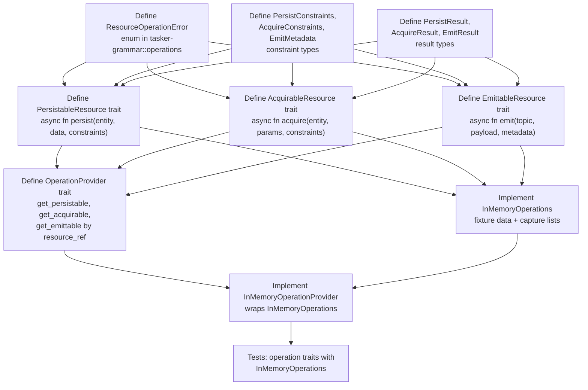

### Lane 1C: Side-Effecting Executors

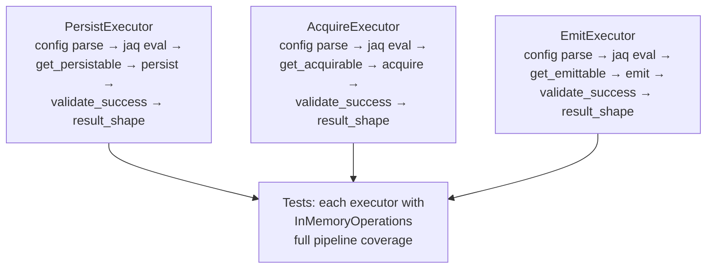

### Lane 1D: Composition Engine

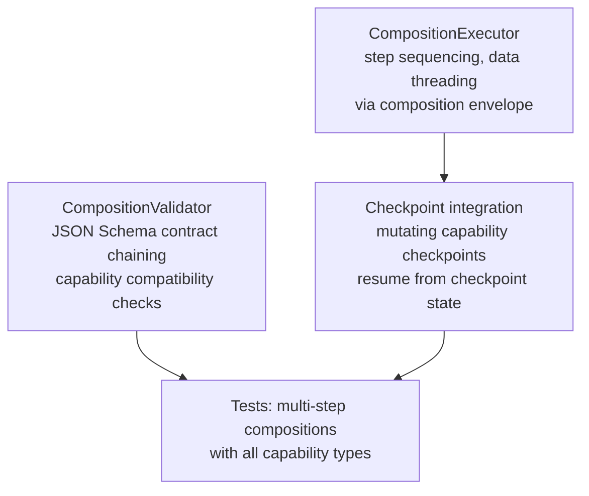

### Lane 1E: Workflow Modeling & Acceptance

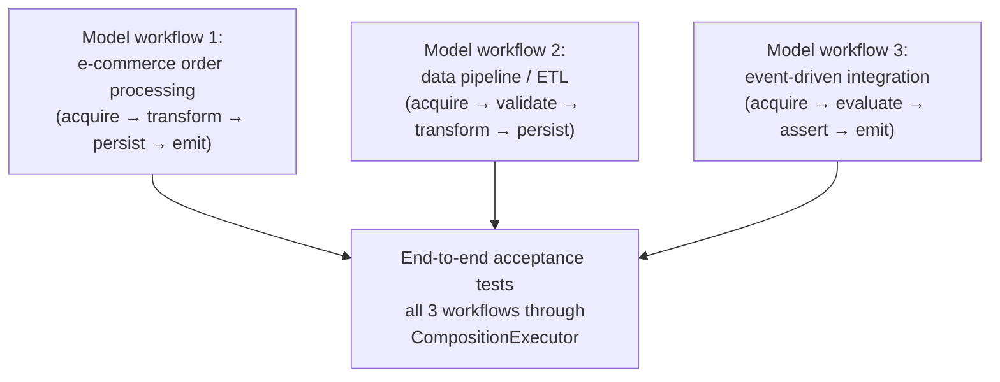

---

## Phase 2: Runtime Infrastructure — Lane Detail

### Lane 2A: Runtime Scaffolding & Adapters

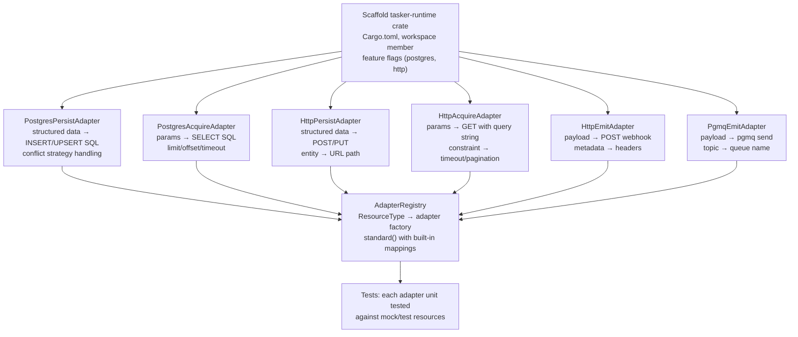

### Lane 2B: ResourcePoolManager

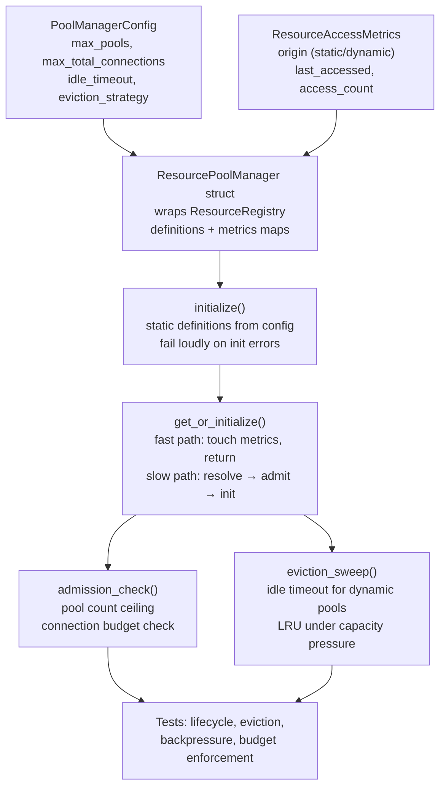

### Lane 2C: ResourceDefinitionSource

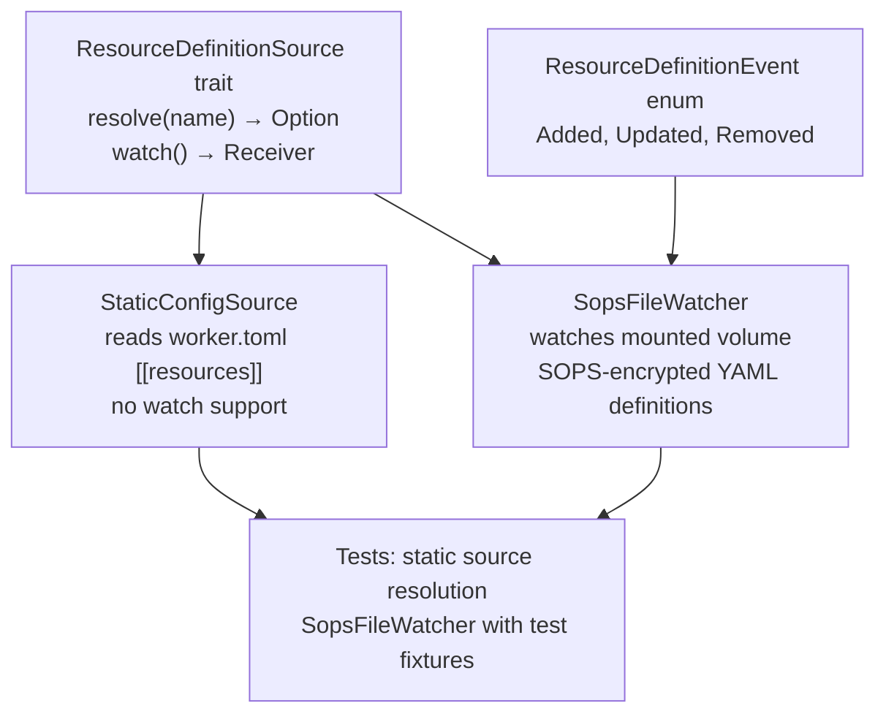

### Lane 2D: RuntimeOperationProvider

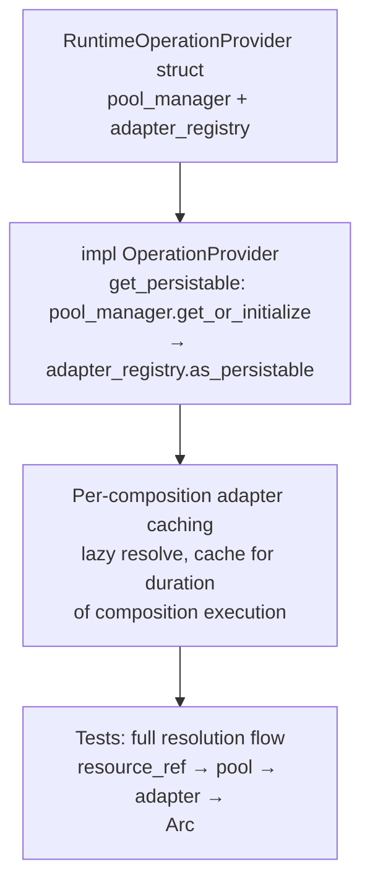

---

## Phase 3: Integration & Tooling — Lane Detail

### Lane 3A: StepContext Rename

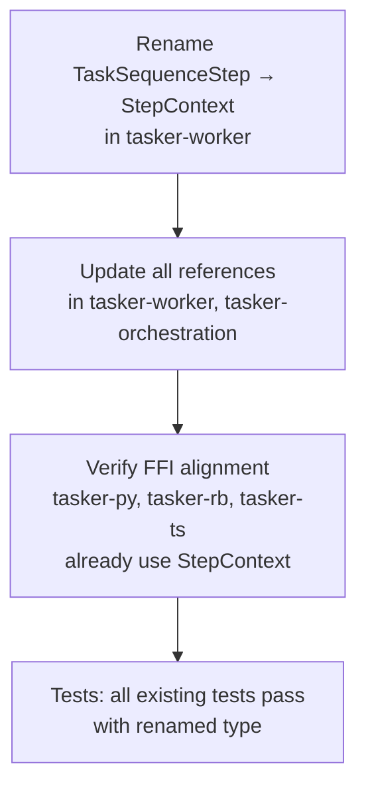

### Lane 3B: CompositionExecutionContext

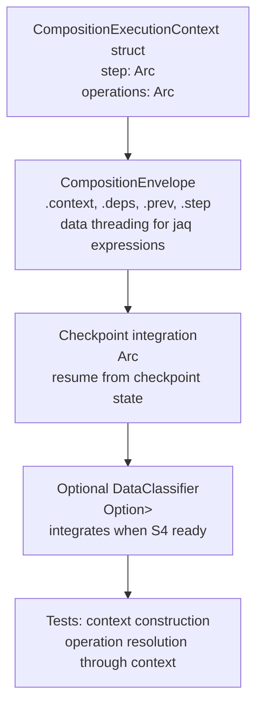

### Lane 3C: Validation Tooling

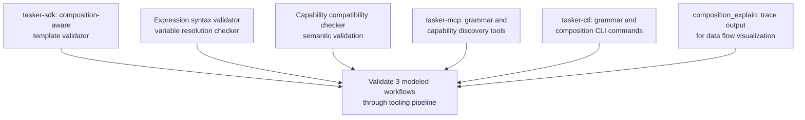

### Lane 3D: Secure Foundations Integration

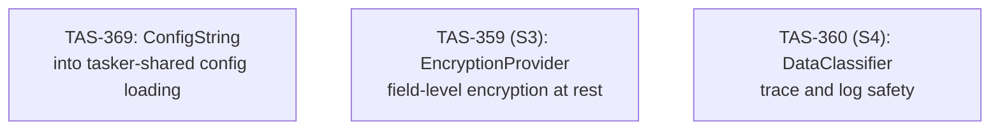

*All items in lane 3D are independent of each other and of other lanes.*

---

## Phase 4: Worker Dispatch & Queues — Lane Detail

### Lane 4A: GrammarActionResolver

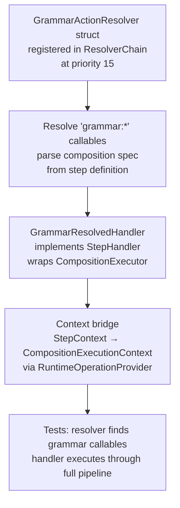

### Lane 4B: Composition Queue Routing

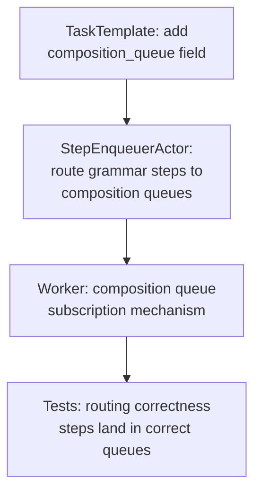

### Lane 4C: tasker-rs Binary

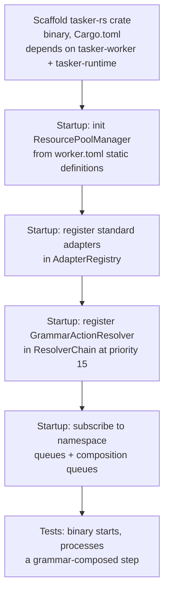

### Lane 4D: End-to-End Acceptance

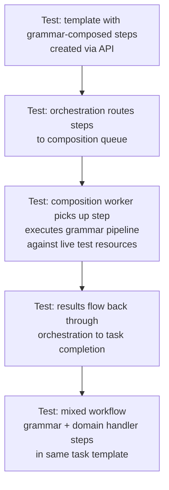

---

## Full Cross-Phase Dependency Graph

This diagram shows all lanes across all phases with their cross-phase dependencies.

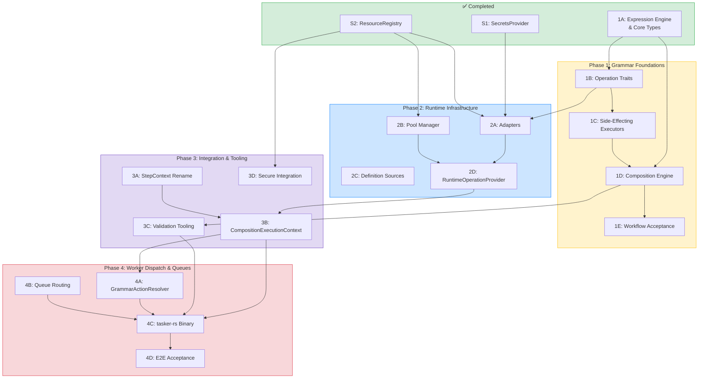
