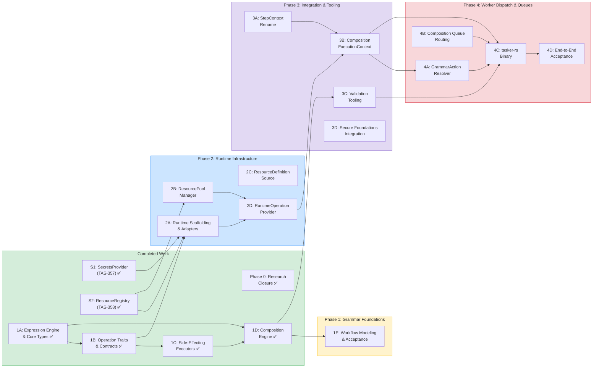
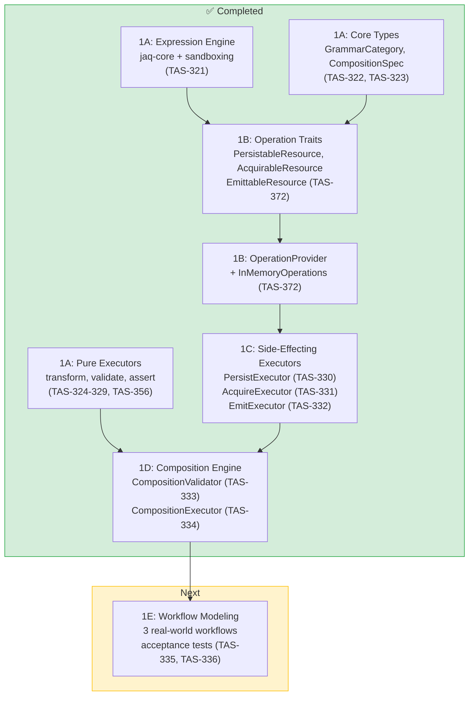
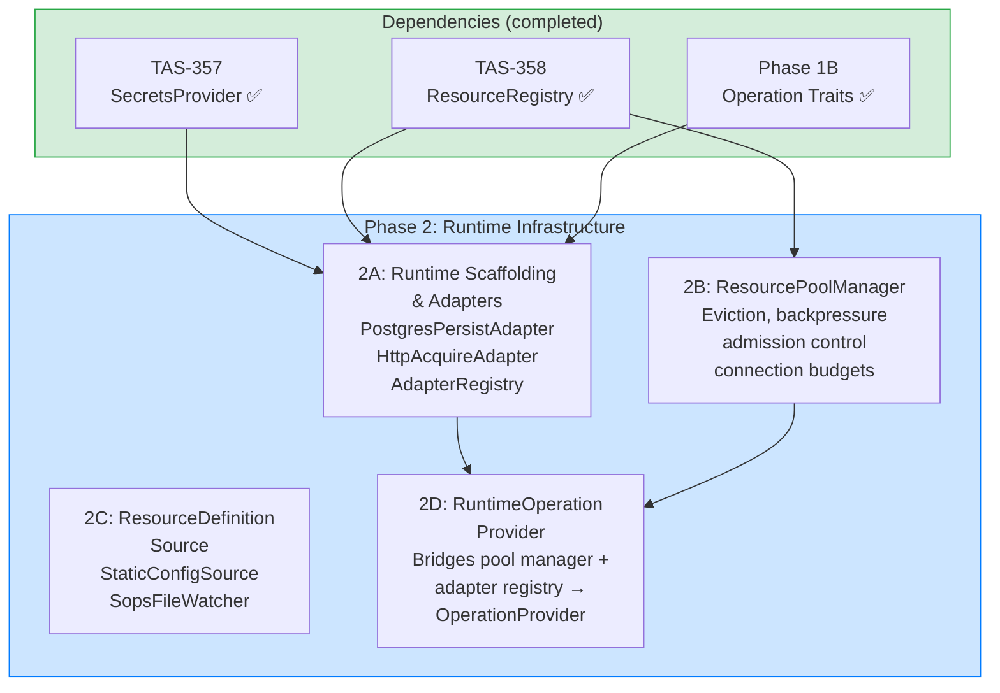
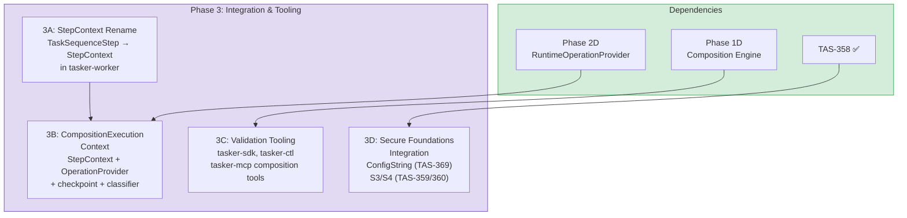
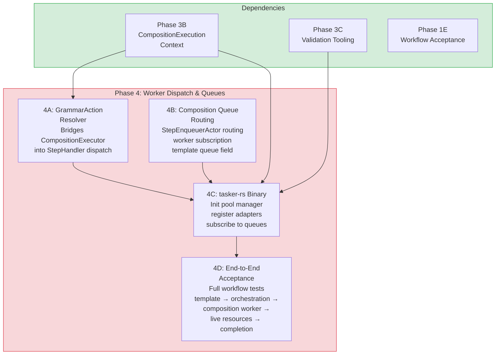

# Composition Architecture Roadmap

*Single authoritative sequencing document for grammar, runtime, and secure foundations work*

*March 2026 — Supersedes `docs/action-grammar/implementation-phases.md`*

*All completed work merged to `main`. Active work on feature branches.*

---

## Purpose

This document is the cognitive anchor for all composition architecture work. It answers three questions:

1. **Where are we?** — What's done, what's in progress, what's blocked
2. **What's next?** — For any given lane of work, what's the next actionable step
3. **How does it all fit together?** — Where lanes converge, where they're independent, and what the end state looks like

The composition architecture spans three crates and two Linear projects:

- **tasker-secure** — Resource identity, credentials, connection lifecycle
- **tasker-grammar** — Operation contracts, capability executors, composition engine
- **tasker-runtime** — Adapters bridging grammar to secure handles, pool lifecycle, worker context

This roadmap organizes the work into **4 phases with parallel workstream lanes**. Phases represent convergence points. Lanes represent independently progressable work within a phase. You can be deep in any lane and glance at this document to see where it fits.

### Reading This Document

- **Quick orientation**: Read the eagle-eye diagram and phase overview table below
- **Planning a work session**: Read the relevant phase section and its per-phase diagram
- **Task-level detail**: See [dependency-diagrams.md](dependency-diagrams.md) for lane-detail diagrams
- **Ticket mapping**: See Appendix B for Linear ticket reconciliation

### Related Documents

This roadmap is informed by and references:

| Document | Role |
|----------|------|
| [resource-handle-traits-and-seams.md](../research/resource-handle-traits-and-seams.md) | Architectural design for operation traits, adapters, and crate topology |
| [actions-traits-and-capabilities.md](../action-grammar/actions-traits-and-capabilities.md) | Foundational grammar architecture and capability model |
| [transform-revised-grammar.md](../action-grammar/transform-revised-grammar.md) | 6-capability model with jaq-core expression engine |
| [grammar-trait-boundary.md](../action-grammar/grammar-trait-boundary.md) | Grammar trait system and handler dispatch integration |
| [virtual-handler-dispatch.md](../action-grammar/virtual-handler-dispatch.md) | Composition queues and worker segmentation |
| [composition-validation.md](../action-grammar/composition-validation.md) | JSON Schema contract chaining and validation |
| [checkpoint-generalization.md](../action-grammar/checkpoint-generalization.md) | Checkpoint model for composition state |
| [security-and-secrets/00-problem-statement.md](../research/security-and-secrets/00-problem-statement.md) | Three security concerns (credentials, trace safety, encryption) |
| [security-and-secrets/02-resource-registry.md](../research/security-and-secrets/02-resource-registry.md) | ResourceHandle and ResourceRegistry design |
| [operation-shape-constraints.md](operation-shape-constraints.md) | Design constraints for persist/acquire operations — what they do and don't do |

---

## Eagle-Eye View

---

## Phase Overview

| Phase | Goal | Lanes | Status |
|-------|------|-------|--------|
| **1: Grammar Foundations** | All capability executors work with in-memory test doubles. Composition engine chains them. | 1A ✅, 1B ✅, 1C ✅, 1D ✅, 1E | ~95% complete (only 1E acceptance tests remaining) |
| **2: Runtime Infrastructure** | tasker-runtime crate exists with adapters, pool manager, and operation provider | 2A, 2B, 2C, 2D | Not started (unblocked — 1B complete) |
| **3: Integration & Tooling** | Composition tooling works, StepContext aligned, CompositionExecutionContext exists | 3A, 3B, 3C, 3D | Not started |
| **4: Worker Dispatch & Queues** | Composition worker binary receives, executes, and completes grammar-composed steps | 4A, 4B, 4C, 4D | Not started |

**Key parallelism opportunities:**
- **Lane 1D** is the new critical path — it completes Phase 1 and unblocks 1E and 3C
- **Lane 2A** is now unblocked (1B complete) — can start alongside 1D
- Lanes 2B, 2C can start immediately (depend only on completed TAS-358)
- Lane 3A (StepContext rename) can start anytime — zero dependencies on other lanes
- Lane 3D (ConfigString, S3/S4) is fully independent of all other lanes

---

## Phase 1: Grammar Foundations

**Done when:** All six capability executors (transform, validate, assert, persist, acquire, emit) work with in-memory test doubles. CompositionValidator and CompositionExecutor chain capabilities into multi-step compositions. Three real-world workflows pass end-to-end acceptance tests.

**Crate scope:** tasker-grammar only. No I/O dependencies. All tests use `InMemoryOperations`.

### Lane 1A: Expression Engine & Core Types — COMPLETE

All foundational grammar work is done:

- jaq-core expression engine with sandboxing (execution timeouts, output size limits)
- Core types: `GrammarCategory`, `CapabilityDeclaration`, `CompositionSpec`, `CompositionStep`
- Pure capability executors: `transform` (projection, arithmetic, aggregation, boolean evaluation, rule-engine patterns), `validate` (schema, coercion, filtering), `assert` (composable execution gates)
- Comprehensive test coverage across all pure capabilities

### Lane 1B: Operation Traits & Contracts — COMPLETE

**Status:** Merged to main (TAS-372, PR #290)

**Delivered:**
- `PersistableResource`, `AcquirableResource`, `EmittableResource` trait definitions in `tasker-grammar::operations::traits`
- Constraint and result types: `PersistConstraints`, `AcquireConstraints`, `EmitMetadata`, `PersistResult`, `AcquireResult`, `EmitResult`, `ConflictStrategy` in `tasker-grammar::operations::types`
- `ResourceOperationError` enum in `tasker-grammar::operations::error`
- `OperationProvider` trait — the seam between grammar and runtime
- `InMemoryOperations` test double in `tasker-grammar::operations::testing`

**Unblocked:** Lane 1C (executors) ✅, Lane 2A (adapters) ✅

### Lane 1C: Side-Effecting Executors — COMPLETE

**Status:** All three merged to main

**Delivered:**
- `PersistExecutor` (TAS-330, PR #291) — config parse → jaq expression eval → `PersistableResource::persist()` → validate_success → result_shape
- `AcquireExecutor` (TAS-331, PR #299) — config parse → jaq expression eval → `AcquirableResource::acquire()` → validate_success → result_shape
- `EmitExecutor` (TAS-332, PR #299) — config parse → jaq expression eval → `EmittableResource::emit()` → validate_success → result_shape

All executors use `InMemoryOperations` for testing — zero I/O. Full pipeline coverage in each.

**Unblocked:** Lane 1D (composition engine) ✅

### Lane 1D: Composition Engine — COMPLETE

**Status:** Both components merged to main

**Delivered:**
- `CompositionValidator` (TAS-333, PR #300) — validates composition specs end-to-end. JSON Schema contract chaining via `SchemaShape` / `schema_compat` module. ~2100 lines including comprehensive test suite.
- `CompositionExecutor` (TAS-334, PR #301) — standalone capability chaining with data threading via composition envelope (`.context`, `.deps`, `.prev`, `.step`). ~940 lines including tests.

**Unblocked:** Lane 1E (acceptance tests) ✅, Lane 3C (validation tooling) ✅

### Lane 1E: Workflow Modeling & Acceptance

**What:** Model 3 real-world workflows as composition specs and run them end-to-end through the composition engine with `InMemoryOperations`.

**Where:** `tasker-grammar` test suite

**Depends on:** Lane 1D (composition engine must be functional)

**Purpose:** Validates that the grammar system can express real business logic, not just toy examples. These workflows become the acceptance test suite that guards against regressions.

---

## Phase 2: Runtime Infrastructure

**Done when:** `tasker-runtime` crate exists with adapter implementations bridging grammar operations to secure handles, a `ResourcePoolManager` for dynamic resource lifecycle, and a `RuntimeOperationProvider` that wires everything into the `OperationProvider` interface.

**Crate scope:** New `tasker-runtime` crate. Depends on both `tasker-secure` (handles to wrap) and `tasker-grammar` (operation traits to implement).

### Lane 2A: Runtime Scaffolding & Adapters

**What:** Scaffold `tasker-runtime` crate. Implement the adapter pattern — each adapter wraps a `tasker-secure` handle and implements a `tasker-grammar` operation trait.

**Where:** New `tasker-runtime` crate, `adapters/` module

**Depends on:** Phase 1B (operation traits to implement), TAS-357/358 (handles to wrap — both complete)

**Deliverables:**
- `tasker-runtime` crate scaffolded in workspace
- `PostgresPersistAdapter` — wraps `PostgresHandle`, implements `PersistableResource` via SQL generation
- `PostgresAcquireAdapter` — wraps `PostgresHandle`, implements `AcquirableResource` via SELECT generation
- `HttpPersistAdapter` — wraps `HttpHandle`, implements `PersistableResource` via POST/PUT
- `HttpAcquireAdapter` — wraps `HttpHandle`, implements `AcquirableResource` via GET
- `HttpEmitAdapter` — wraps `HttpHandle`, implements `EmittableResource` via POST (webhook)
- `PgmqEmitAdapter` — wraps future `PgmqHandle`, implements `EmittableResource`
- `AdapterRegistry` — maps `(ResourceType, OperationTrait)` to adapter factories

**Key design point:** Each adapter knows exactly two things — the grammar contract and the handle's I/O protocol. Nothing else.

**Design reference:** [resource-handle-traits-and-seams.md §Adapters](../research/resource-handle-traits-and-seams.md)

### Lane 2B: ResourcePoolManager — CAN START IMMEDIATELY

**What:** Wrap `ResourceRegistry` with lifecycle management for dynamic resource pools. Eviction, backpressure, admission control, connection budgets.

**Where:** `tasker-runtime::pool_manager`

**Depends on:** TAS-358 only (ResourceRegistry — already complete)

**Deliverables:**
- `ResourcePoolManager` — wraps `ResourceRegistry` with `get_or_initialize()`, eviction sweep, admission control
- `PoolManagerConfig` — max_pools, max_total_connections, idle_timeout, sweep_interval, eviction/budget strategies
- `ResourceOrigin` — Static (never evicted) vs Dynamic (subject to eviction)
- `ResourceAccessMetrics` — per-resource usage tracking for eviction decisions
- Connection budget enforcement at pool creation time

**Why it can start now:** The only dependency is `ResourceRegistry` from TAS-358, which is complete. No dependency on grammar traits or adapters.

**Design reference:** [resource-handle-traits-and-seams.md §ResourcePoolManager Design](../research/resource-handle-traits-and-seams.md)

### Lane 2C: ResourceDefinitionSource — CAN START IMMEDIATELY

**What:** Trait and implementations for resolving resource definitions at runtime, enabling dynamic resource creation from generative workflows.

**Where:** `tasker-runtime::sources`

**Depends on:** TAS-358 only (`ResourceDefinition` type)

**Deliverables:**
- `ResourceDefinitionSource` trait — `resolve(name) → Option<ResourceDefinition>`, optional `watch()` for change events
- `StaticConfigSource` — reads from `worker.toml` `[[resources]]` sections
- `SopsFileWatcher` — watches mounted volumes for SOPS-encrypted resource definition files
- `ResourceDefinitionEvent` — Added/Updated/Removed events for dynamic sources

### Lane 2D: RuntimeOperationProvider — CONVERGENCE POINT

**What:** Bridges `ResourcePoolManager` + `AdapterRegistry` into the `OperationProvider` interface that tasker-grammar expects.

**Where:** `tasker-runtime::context`

**Depends on:** Lanes 2A (adapter registry) + 2B (pool manager)

**Deliverables:**
- `RuntimeOperationProvider` implementing `OperationProvider` trait
- Resolution flow: `get_persistable("orders-db")` → pool_manager.get_or_initialize → adapter_registry.as_persistable → `Arc<dyn PersistableResource>`
- Per-composition caching of resolved adapters

**This is the seam.** Grammar executors call `context.operations.get_persistable(...)` and get back the same trait they tested against with `InMemoryOperations`. The only difference is that now it's a `PostgresPersistAdapter` wrapping a live `PostgresHandle`.

---

## Phase 3: Integration & Tooling

**Done when:** StepContext naming is aligned across Rust and FFI crates. `CompositionExecutionContext` exists in tasker-runtime and wires together StepContext + OperationProvider + checkpoint + classifier. Validation tooling in tasker-sdk/tasker-ctl/tasker-mcp enables developers to validate compositions offline. Secure foundations integration (ConfigString, optionally S3/S4) is complete.

**Crate scope:** tasker-worker (rename), tasker-runtime (context), tasker-sdk/tasker-ctl/tasker-mcp (tooling), tasker-shared (ConfigString)

### Lane 3A: StepContext Rename — INDEPENDENT, START ANYTIME

**What:** Rename `TaskSequenceStep` to `StepContext` in tasker-worker to align Rust naming with the FFI crates (tasker-py, tasker-rb, tasker-js already use `StepContext`).

**Where:** `tasker-worker`

**Depends on:** Nothing. Pure naming change.

**Scope:** This is the portion of TAS-370 that survives. The `ExecutionContext` portion moves to tasker-runtime as `CompositionExecutionContext` (lane 3B).

### Lane 3B: CompositionExecutionContext

**What:** The enriched context for grammar capability executors. Contains everything in StepContext plus `OperationProvider`, composition envelope, checkpoint state, and data classifier reference.

**Where:** `tasker-runtime::context`

**Depends on:** Lane 2D (RuntimeOperationProvider), Lane 3A (StepContext type)

**Key design point:** This context never crosses FFI. Domain handlers continue receiving `StepContext`. Grammar executors receive `CompositionExecutionContext`. The boundary is clean.

**Design reference:** [resource-handle-traits-and-seams.md §StepContext and ExecutionContext Boundary](../research/resource-handle-traits-and-seams.md)

### Lane 3C: Validation Tooling

**What:** Composition-aware tooling for template validation, expression checking, capability compatibility, and composition explanation.

**Where:** `tasker-sdk`, `tasker-ctl`, `tasker-mcp`

**Depends on:** Phase 1D (CompositionValidator and engine)

**Deliverables:**
- Composition-aware template validator in tasker-sdk
- Expression syntax and variable resolution validators
- Capability compatibility checker
- MCP grammar and capability discovery tools
- tasker-ctl grammar and composition commands
- `composition_explain` trace output for data flow visualization
- Validation of 3 modeled workflows through tooling pipeline

### Lane 3D: Secure Foundations Integration — INDEPENDENT

**What:** Dog-food ConfigString into tasker-shared config loading (TAS-369). Optionally begin S3 (EncryptionProvider) and S4 (DataClassifier) from Tasker Secure Foundations Milestone 2.

**Where:** `tasker-shared` (ConfigString), `tasker-secure` (S3/S4)

**Depends on:** TAS-358 (done). Fully independent of all other lanes.

**Note:** S3 and S4 are not blocking for the composition worker. The `DataClassifier` reference in `CompositionExecutionContext` is `Option<Arc<DataClassifier>>` — it integrates when ready but doesn't block.

---

## Phase 4: Worker Dispatch & Composition Queues

**Done when:** A composition worker binary (`tasker-rs`) can receive grammar-composed steps via composition queues, execute them against live resources through the full pipeline (grammar executors → operation traits → adapters → secure handles), and report completion back to the orchestrator.

**Crate scope:** New `tasker-rs` binary crate. Composes `tasker-worker` + `tasker-runtime`. Also touches `tasker-orchestration` (queue routing) and `tasker-worker` (dispatch integration).

### Lane 4A: GrammarActionResolver

**What:** Bridges `CompositionExecutor` into the `StepHandler` dispatch pipeline. Registered in `ResolverChain` at priority 15. Resolves `"grammar:*"` callables into a handler that wraps the composition execution pipeline.

**Where:** `tasker-rs`

**Depends on:** Phase 3B (CompositionExecutionContext)

**Key design point:** This handler implements `StepHandler` so it fits the existing dispatch pipeline, but internally constructs a `CompositionExecutionContext` and delegates to the grammar execution pipeline.

### Lane 4B: Composition Queue Routing

**What:** Enable template-driven routing of grammar-composed steps to composition queues that composition workers subscribe to.

**Where:** `tasker-orchestration` (StepEnqueuerActor), `tasker-worker` (subscription), `tasker-shared` (TaskTemplate field)

**Deliverables:**
- `composition_queue` field on `TaskTemplate`
- StepEnqueuerActor routes grammar steps to composition queues
- Worker composition queue subscription mechanism

**Design reference:** [virtual-handler-dispatch.md](../action-grammar/virtual-handler-dispatch.md)

### Lane 4C: tasker-rs Binary — CONVERGENCE POINT

**What:** The composition-capable worker binary. Composes tasker-worker + tasker-runtime into a binary that can execute grammar compositions against live resources.

**Where:** New `tasker-rs` crate (binary)

**Depends on:** Lanes 4A + 4B + Phase 3B + Phase 3C

**Startup sequence:**
1. Initialize `ResourcePoolManager` with static resource definitions from `worker.toml`
2. Register standard adapters in `AdapterRegistry`
3. Register `GrammarActionResolver` in `ResolverChain`
4. Subscribe to namespace queues AND composition queues
5. Begin processing steps

### Lane 4D: End-to-End Acceptance

**What:** Full workflow tests validating the complete pipeline from template creation through orchestration, composition worker execution against live resources, and task completion.

**Where:** Integration test suite

**Depends on:** Lane 4C (tasker-rs binary must be functional)

---

## Cross-Cutting Concerns

### Crate Creation Sequence

New crates need to be scaffolded at specific points:

| Crate | When | Phase |
|-------|------|-------|
| `tasker-runtime` | Start of Phase 2 (or when 2B/2C begin, whichever is first) | 2 |
| `tasker-rs` | Start of Phase 4 | 4 |

### Testing Strategy

Each phase has a different testing profile:

| Phase | Test Strategy | Infrastructure Required |
|-------|--------------|------------------------|
| 1 | Pure unit tests with `InMemoryOperations` | None |
| 2 | Unit tests + integration tests against test databases/services | PostgreSQL, HTTP mock server |
| 3 | Unit tests + integration with existing test infrastructure | Existing test services |
| 4 | Full E2E tests with composition worker binary | Full service stack |

### Worker Segmentation

Phase 4 introduces a new worker type. The operational model:

- **Domain workers** (existing): `tasker-worker` + domain crates. No grammar knowledge.
- **Composition workers** (new): `tasker-rs` = `tasker-worker` + `tasker-runtime`. Grammar-capable, resource pool management.
- Task templates freely mix both handler types. Queue routing handles segmentation.

---

## What Can Start Now

For quick reference, these lanes have zero unmet dependencies and can begin immediately:

| Lane | Description | Depends On | Priority |
|------|-------------|------------|----------|
| **1E** | Workflow modeling — 3 real-world acceptance tests | 1D ✅ | High — validates Phase 1, proves composition system end-to-end |
| **2A** | Runtime scaffolding + adapters in tasker-runtime | 1B ✅, TAS-357 ✅, TAS-358 ✅ | High — unblocks 2D |
| **2B** | ResourcePoolManager in tasker-runtime | TAS-358 ✅ | High — unblocks 2D |
| **2C** | ResourceDefinitionSource in tasker-runtime | TAS-358 ✅ | Medium |
| **3A** | StepContext rename in tasker-worker | Nothing | Low — pure refactor |
| **3D** | ConfigString integration / S3 / S4 | TAS-358 ✅ | Low — independent |

**Phase 1 core is complete.** Lane 1E (acceptance tests) validates the grammar system. Phase 2 runtime work can proceed in parallel.

**Note:** Lanes 2A, 2B, 2C all require scaffolding `tasker-runtime` first (TAS-373). Whichever lane starts first should scaffold the crate.

---

## Appendix A: Reference Documents

### Composition Architecture (this directory)

| Document | Content |
|----------|---------|
| [roadmap.md](roadmap.md) | This document — authoritative sequencing |
| [dependency-diagrams.md](dependency-diagrams.md) | Level 3 lane-detail mermaid diagrams |

### Design Documents (inform the roadmap)

| Document | Content | Informs |
|----------|---------|---------|
| [resource-handle-traits-and-seams.md](../research/resource-handle-traits-and-seams.md) | Operation traits, adapters, crate topology, pool manager, worker segmentation | Phases 1B, 2, 3B, 4 |
| [actions-traits-and-capabilities.md](../action-grammar/actions-traits-and-capabilities.md) | 8-capability model, (action, resource, context) triple | Phase 1 |
| [transform-revised-grammar.md](../action-grammar/transform-revised-grammar.md) | jaq-core integration, 6-capability consolidation | Phase 1A (done) |
| [grammar-trait-boundary.md](../action-grammar/grammar-trait-boundary.md) | Grammar trait system, handler dispatch | Phases 1D, 4A |
| [virtual-handler-dispatch.md](../action-grammar/virtual-handler-dispatch.md) | Composition queues, worker segmentation | Phase 4 |
| [composition-validation.md](../action-grammar/composition-validation.md) | JSON Schema contract chaining | Phases 1D, 3C |
| [checkpoint-generalization.md](../action-grammar/checkpoint-generalization.md) | Checkpoint model for composition state | Phases 1D, 3B |

### Security & Secrets Research

| Document | Content | Informs |
|----------|---------|---------|
| [00-problem-statement.md](../research/security-and-secrets/00-problem-statement.md) | Three security concerns | All secure foundations work |
| [01-secrets-and-credential-injection.md](../research/security-and-secrets/01-secrets-and-credential-injection.md) | SecretsProvider strategy | TAS-357 (done) |
| [02-resource-registry.md](../research/security-and-secrets/02-resource-registry.md) | ResourceHandle and ResourceRegistry design | TAS-358 (done), Phase 2 |
| [03-trace-and-log-safety.md](../research/security-and-secrets/03-trace-and-log-safety.md) | DataClassifier for PII redaction | Lane 3D (S4) |
| [04-encryption-at-rest.md](../research/security-and-secrets/04-encryption-at-rest.md) | EncryptionProvider for field-level encryption | Lane 3D (S3) |
| [05-tasker-secure-crate-proposal.md](../research/security-and-secrets/05-tasker-secure-crate-proposal.md) | Full crate structure | TAS-357/358 (done) |
| [06-research-spikes.md](../research/security-and-secrets/06-research-spikes.md) | Four phased spikes (S1-S4) | All secure foundations work |

### Historical (superseded by this roadmap)

| Document | Status | Notes |
|----------|--------|-------|
| [implementation-phases.md](../action-grammar/implementation-phases.md) | **Superseded** | Original 4-phase plan. Phase structure and ticket mapping no longer accurate. Useful as historical context for original design rationale. |
| [phase-0-completion-assessment.md](../action-grammar/phase-0-completion-assessment.md) | **Historical** | Phase 0 closure assessment. All criteria met or mooted. |

---

## Appendix B: Ticket Reconciliation

This appendix maps roadmap lanes to Linear tickets across both projects. Use this when restructuring Linear after the roadmap is established.

### Tasker Secure Foundations

| Ticket | Current Status | Roadmap Lane | Action Needed |
|--------|---------------|--------------|---------------|
| TAS-357 | Done | — | No change. S1 complete. |
| TAS-358 | Done | — | No change. S2 complete. |
| TAS-369 | Backlog | 3D | No change. ConfigString integration into tasker-shared. |
| TAS-370 | Backlog | 3A + 3B | **Split.** StepContext rename (3A) is one ticket. CompositionExecutionContext (3B) is a separate ticket in a different crate (tasker-runtime, not tasker-worker). Original scope of "ExecutionContext in tasker-worker with ResourceRegistry integration" is superseded by the three-crate architecture. |
| TAS-359 | Backlog | 3D | No change. S3: EncryptionProvider. Independent, non-blocking. |
| TAS-360 | Backlog | 3D | No change. S4: DataClassifier. Independent, non-blocking. |
| TAS-371 | Backlog | — | **Evaluate.** tasker-cfg extraction. May be deprioritized given the crate topology established by this architecture. |

### Tasker Action Grammar — Phase 1

| Ticket | Current Status | Roadmap Lane | Action Needed |
|--------|---------------|--------------|---------------|
| TAS-321 | Done | 1A | No change. |
| TAS-322 | Done | 1A | No change. |
| TAS-323 | Done | 1A | No change. |
| TAS-324 | Done | 1A | No change. |
| TAS-325-329 | Done | 1A | No change. |
| TAS-356 | Done | 1A | No change. |
| TAS-330 | Done | 1C | Merged (PR #291). PersistExecutor implemented with OperationProvider pattern. |
| TAS-331 | Done | 1C | Merged (PR #299). AcquireExecutor implemented with OperationProvider pattern. |
| TAS-332 | Done | 1C | Merged (PR #299). EmitExecutor implemented with OperationProvider pattern. |
| TAS-333 | Done | 1D | Merged (PR #300). CompositionValidator with JSON Schema contract chaining, SchemaShape typed compatibility. |
| TAS-334 | Done | 1D | Merged (PR #301). CompositionExecutor with capability chaining + data threading via composition envelope. |
| TAS-335 | Backlog | 1E | No change. |
| TAS-336 | Backlog | 1E | No change. |
| TAS-363 | Backlog | — | **Evaluate.** SIMD JSON spike. Independent research, not on critical path. |

### Tasker Action Grammar — Phases 2-4 (Original)

| Ticket | Current Status | Roadmap Lane | Action Needed |
|--------|---------------|--------------|---------------|
| TAS-337 | Backlog | 3C | **Move** from original Phase 2 to roadmap Phase 3. No content change. |
| TAS-338 | Backlog | 3C | **Move** to roadmap Phase 3. |
| TAS-339 | Backlog | 3C | **Move** to roadmap Phase 3. |
| TAS-340 | Backlog | 3C | **Move** to roadmap Phase 3. |
| TAS-341 | Backlog | 3C | **Move** to roadmap Phase 3. |
| TAS-342 | Backlog | 3C | **Move** to roadmap Phase 3. |
| TAS-343 | Backlog | 3C | **Move** to roadmap Phase 3. |
| TAS-344 | Backlog | 3C | **Move** to roadmap Phase 3. |
| TAS-345 | Backlog | 3C | **Move** to roadmap Phase 3. |
| TAS-346 | Backlog | 4A/4B | **Revise.** "Add composition field to StepDefinition" — still valid but now part of lane 4B. |
| TAS-347 | Backlog | 4A | **Revise significantly.** "CompositionExecutor as StepHandler" becomes "GrammarActionResolver" in tasker-rs, not tasker-worker. The design has changed: CompositionExecutor stays standalone in tasker-grammar; the resolver in tasker-rs wraps it via CompositionExecutionContext. |
| TAS-348 | Backlog | 4A | **Revise.** "Integrate composition routing in HandlerDispatchService" — still relevant but scoping changes with GrammarActionResolver pattern. |
| TAS-349 | Backlog | 4D | **Move** to roadmap Phase 4. Update scope to include tasker-rs binary. |
| TAS-350 | Backlog | 4B | No major change. Composition queue routing in StepEnqueuerActor. |
| TAS-351 | Backlog | 4B | No major change. Worker queue subscription. |
| TAS-352 | Backlog | 4B | No major change. TaskTemplate composition_queue field. |
| TAS-353 | Backlog | 4C | **Revise.** "workers/composition crate and binary" → now `tasker-rs` binary composing tasker-worker + tasker-runtime. Different crate structure than originally planned. |
| TAS-354 | Backlog | 4C | No major change. Dockerfile for composition worker. |
| TAS-355 | Backlog | 4D | No major change. Integration and scaling tests. |

### New Tickets Needed

| Roadmap Lane | Description | Project |
|-------------|-------------|---------|
| ~~1B~~ | ~~Define operation traits~~ | ~~Done (TAS-372, PR #290)~~ |
| ~~1B~~ | ~~Define OperationProvider interface and InMemoryOperations~~ | ~~Done (TAS-372, PR #290)~~ |
| 2 | Scaffold tasker-runtime crate with workspace integration (TAS-373) | Action Grammar |
| 2A | Implement adapter pattern (PostgresPersistAdapter, HttpAcquireAdapter, etc.) | Action Grammar or new project |
| 2A | Implement AdapterRegistry | Action Grammar or new project |
| 2B | Implement ResourcePoolManager with eviction and backpressure | Action Grammar or new project |
| 2C | Implement ResourceDefinitionSource trait and StaticConfigSource | Action Grammar or new project |
| 2D | Implement RuntimeOperationProvider bridging pool manager + adapters → OperationProvider | Action Grammar or new project |
| 3B | Implement CompositionExecutionContext in tasker-runtime (split from TAS-370) | Secure Foundations or new project |

### Project Organization Question

Lanes 2A-2D introduce `tasker-runtime` — a new crate that doesn't fit cleanly into either existing Linear project. Options:

1. **Add to Tasker Action Grammar** — since the runtime exists to serve grammar compositions
2. **Add to Tasker Secure Foundations** — since the runtime wraps secure handles
3. **New Linear project: Tasker Runtime** — clean separation matching the crate boundary

Recommendation: **(1)** — the runtime crate exists because the grammar needs it. The secure foundations work is done at the handle level. Adding a third project increases coordination overhead without proportional benefit.
