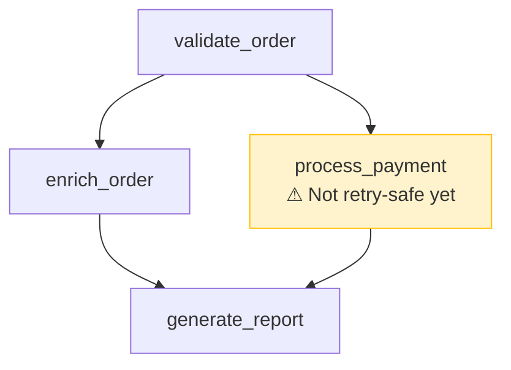

# TAS-316: Template Visualize — Offline Mermaid Generation from TaskTemplate YAML

**Status**: Approved
**Date**: 2026-03-05
**Branch**: `jcoletaylor/tas-316-template-visualize-offline-mermaidsvg-generation-from`

## Summary

Build offline, deterministic visualization of TaskTemplate YAML as Mermaid diagrams with accompanying detail tables. Output is Mermaid syntax (`.mmd` / fenced markdown) — SVG rendering is left to the user's tooling (VS Code, GitHub, mmdc, LLM clients, etc.).

## Decisions

| Decision | Choice | Rationale |
|----------|--------|-----------|
| SVG rendering | Out of scope | Mermaid is the universal interchange format; rendering is solved everywhere |
| Annotations | Sidecar YAML file | Keeps runtime types clean; annotations evolve independently |
| Diagram density | Clean DAG + detail table | DAG stays scannable; table provides reference data |
| Virtual handler styling | Stub now, activate on composition | Infrastructure ready for TAS-318 without code changes |
| CLI output | Markdown by default, `--graph-only` flag | Composable for scripting pipelines |
| CLI input | File path or stdin (`-`) | Supports agent/script piping workflows |

## Architecture

### Module Structure

```
tasker-sdk/src/visualization/
  mod.rs              — Public API: visualize_template()
  mermaid.rs          — Mermaid graph generation
  detail_table.rs     — Markdown detail table generation
```

Integration points (thin wrappers):
- `tasker-ctl/src/commands/template.rs` — `Visualize` variant in `TemplateCommands`
- `tasker-mcp/src/tools/developer.rs` — `template_visualize()` Tier 1 tool

### Data Flow

```
YAML (file/stdin) → parse_template_str() → TaskTemplate
                                              |
                          visualize_template(template, annotations, options)
                                              |
                          VisualizationOutput { mermaid, detail_table }
                                              |
                     format as markdown doc (or graph-only)
```

Core logic lives entirely in tasker-sdk. No new crate dependencies needed.

## Mermaid Graph Generation

- `graph TD` (top-down flowchart)
- Dependencies as directed edges: `dependency --> step`
- Node shapes by type:
  - Domain handler: rectangle `[step_name]`
  - Virtual handler (composition): stadium `([step_name])`
  - Decision step: diamond `{step_name}`
- Parallel branches handled naturally by Mermaid layout (no explicit subgraphs)
- Annotated nodes use `classDef annotated fill:#fff3cd,stroke:#ffc107` with warning indicator

### Example



## Detail Table

Markdown table in topological order, following the Mermaid block:

| Column | Source | Notes |
|--------|--------|-------|
| Step | `step.name` | Always present |
| Type | `step.step_type` | Standard, Decision, Batchable, etc. |
| Handler | `step.handler.callable` | Or "composition" for virtual handlers |
| Dependencies | `step.dependencies` | Comma-separated, or "—" for roots |
| Schema Fields | `step.result_schema` | Top-level property names, or "—" |
| Retry | `step.retry` | e.g., "3 attempts, exponential" or "—" |

## Annotations Format

Sidecar YAML file mapping step names to annotation text:

```yaml
validate_order: "TODO: add result_schema validation"
process_payment: "Not retry-safe yet — will refactor before release"
```

- Parsed as `HashMap<String, String>`
- Unknown step names produce a warning (non-fatal)
- Rendered as second line in Mermaid node label with `:::annotated` class

## CLI Interface

```
tasker-ctl template visualize <template> [--annotations <file>] [--output <file>] [--graph-only]
```

- `<template>` — Path to YAML file, or `-` for stdin
- `--annotations` — Optional sidecar annotations file
- `--output` — Write to file instead of stdout
- `--graph-only` — Emit raw Mermaid graph block only (no fences, no detail table)

## MCP Tool Interface

Tier 1 offline tool in `developer.rs`:

```rust
pub fn template_visualize(params: TemplateVisualizeParams) -> String
```

**Params:**
- `template_yaml: String` — Raw YAML content
- `annotations: Option<HashMap<String, String>>` — Inline annotations
- `graph_only: Option<bool>`

**Response JSON:**
- `mermaid: String` — Raw Mermaid graph
- `detail_table: Option<String>` — Markdown table (absent when graph_only)
- `markdown: String` — Complete markdown document

## Testing

- Unit tests against 3+ existing fixtures (diamond DAG, linear chain, batch workflow)
- Structural validation of Mermaid output (node/edge patterns)
- Annotations rendering with and without sidecar file
- Graph-only vs full markdown output
- CLI stdin handling

## Deliverables

1. `tasker-sdk/src/visualization/` module (mermaid.rs, detail_table.rs)
2. `tasker-ctl template visualize` command with stdin/file/output/graph-only support
3. `tasker-mcp` Tier 1 `template_visualize` tool
4. Unit tests against existing fixtures
5. Generated Mermaid markdown files for `tasker-contrib/examples/{app}` templates

## Out of Scope

- SVG rendering (users bring their own tools)
- Virtual handler composition chain detail (deferred to TAS-318)
- Subgraph grouping (unnecessary for typical template sizes)
